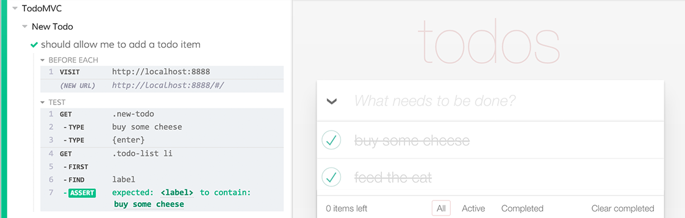

## Integration Tests

Debugger.html integration test are end-to-end tests that simulate a user debugging an application.

The tests open two browser tabs, the debuggee and debugger, and go through the steps of debugging the debuggee.

Here's one test that pauses while creating a Todo.

```js
debugPage("todomvc");
goToSource("js/views/todo-view");
toggleBreakpoint(33);

addTodo();

stepIn();
stepOver();
stepOut();
```

#### Helpful Information
+ `public/js/test/integration` - tests folder
+ `public/js/test/cypress/commands` - test commands folder

#### Running tests
+ `npm run firefox` - launch firefox
+ `cypress run` - runs tests headlessly
+ `cypress open` - opens cypress app

**Installing Cypress**
Cypress needs to be installed before tests can be run.

```bash
npm install -g cypress-cli
cypress install
```

[More Information](https://docs.cypress.io/docs/installing-and-running)

Notes:
+ It's helpful to close the firefox debugger in other tabs as it might cause the tests to miss a firefox message.
+ You can also test chrome by opening chrome and enabling the chrome test in `todomvc.js`.

#### Cypress

The Debugger.html project uses [Cypress](https://www.cypress.io/) for integration tests.

**Features**

+ [Commands](https://docs.cypress.io/docs/issuing-commands) that interact with the app (click, type, ...)
+ [Selectors](https://docs.cypress.io/docs/finding-elements) that wait for elements to be available (get, contains)

**Pro Tips**
+ `it.only` - will only run that test
+ `file watching` - cypress re-runs tests on file changes.

#### Fixtures

We use Cypress to generate the fixtures that are used in the unit tests and storybook stories.

[Fixtures](../public/js/test/integration/fixtures.js) are written like other integration tests, with an extra step for saving a fixture.

+ `public/js/test/integration/fixtures.js` - fixtures file
+ `public/js/test/fixtures` - Fixture folder

Steps:
+ start the cypress server to save the fixtures - `node bin/cypress-server`
+ enable the fixture tests - change `xdescribe` to `describe` in [fixtures.js](../public/js/test/integration/fixtures.js).
+ run cypress - `cypress run`


#### Screenshots


