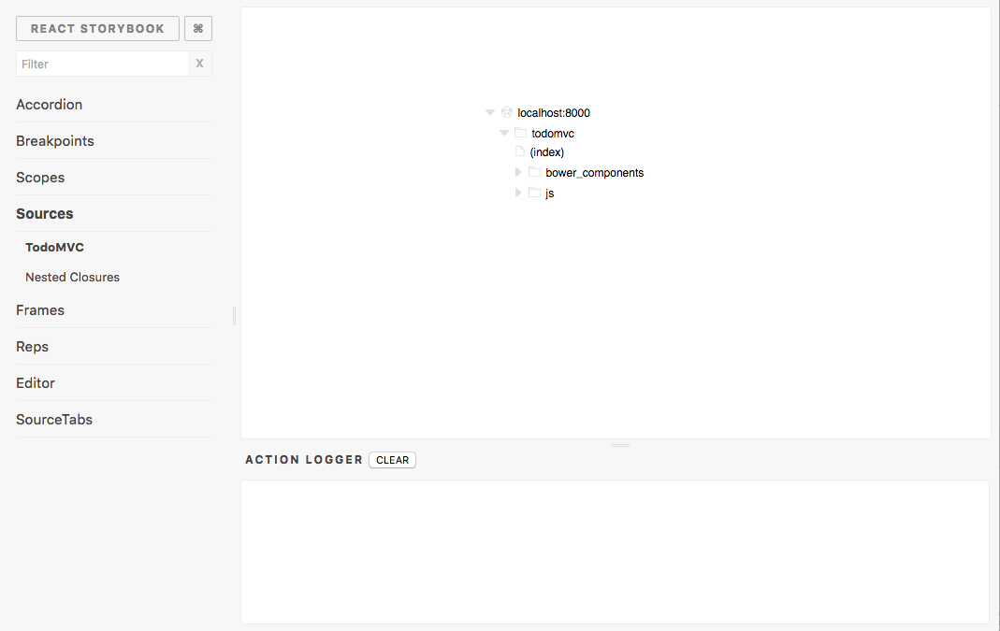

## Local Development

The easiest way to get started debugging firefox is with these two commands.

```bash
`npm run firefox`
`npm start`
```

### Development Server

The development server does many things to help make local development easier.

+ uses webpack to bundle the debugger js and css assets
+ uses webpack-express-middleware to update the bundle on page refresh
+ can enable hot reloading for react components and css
+ starts the firefox proxy, which passes messages between the debugger and debugged firefox browser.
+ builds the set of environment and user config for the debugger.
+ gets the list of chrome tabs that can be debugged.

### Configs

There are a couple types of configs for the debugger:

+ Feature flags - that can turn on/off experimental features
+ Development flags - features like hot reloading or logging that can make it easier to develop
+ Configuration - settings like the firefox websocket port, which set global configuration data.

**Local Configs**

You can easily override values locally for your own environment or development preferences.

Local changes go in a `local.json` file in config next to `development.json`.
If that file does not exist, copy `local.sample.json`.

### Hot Reloading

Hot reloading lets you make changes in React components and CSS and see the changes immediately.
Also, the changes will go into effect without changing the state of app.
Hot reloading does not work all the time, but once you get a sense of its quirks it can be a huge productivity boon.

It can be turned on by setting `config/local.json` with the contents `{ "hotReloading: true" }`.

### Themes

The local debugger supports three themes: light, dark, and firebug.

You can change the theme by setting the `theme` field in `local.json` to  `light`, `dark`, or `firebug`.

```json
{ "theme": "dark" }
```

### Flow

The debugger uses Facebook's [flow](https://flowtype.org/) type checker.

Rationale:
* *code clarity* - helps team members understand the code
* *refactoring* - guarantees functions integrate well
* *code reviews* - adds a static check like linting

**How do I run flow?**
```
> flow
```

**How do I see a file's coverage?**
```
> flow coverage --color <path to file>
```

**How do I see the Debugger's flow coverage?**
```
> npm run flow-coverage
```

### StoryBook

Storybook is a local development environment for react components for viewing components in different states.

**Features:**
+ toggle between different UI states
+ quickly work on a component with hot reloading

**Getting Started:**
* install storybook `npm i -g @kadira/storybook`
+ start storybook `npm run storybook`
+ edit a component story in `public/js/components/stories`


