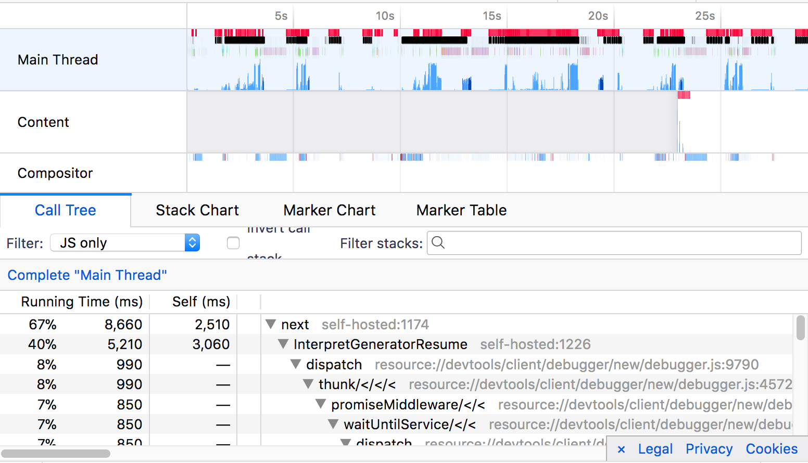
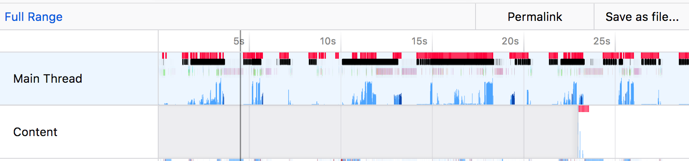
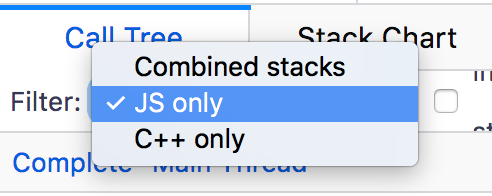
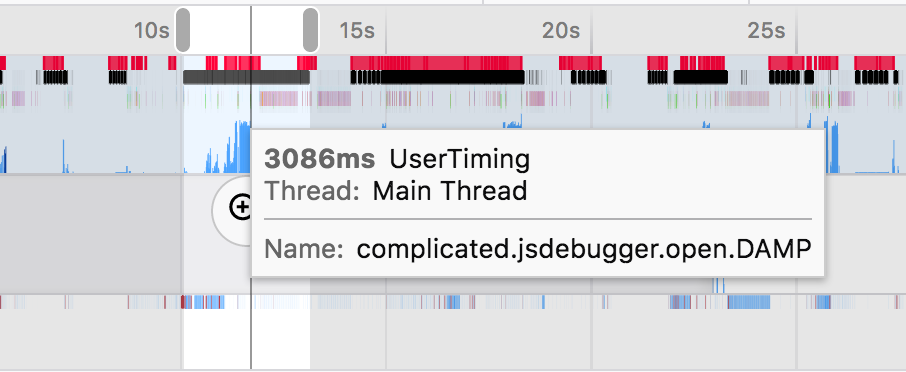

# Performance

## Tools
Performance is tricky, there is just so much data that needs to be considered in order to
determine a performance issue. To add to this, small processes that a computer is running can throw
off performance metrics and put you on the wrong track. This can be very frustrating! It is
important to treat performance work as setting up an experiment that is repeatable, this way one can
minimize the noise and better understand what is happening!

### Perf.html

Perf.html is a firefox devtools project that makes it easy to record and share profiles. It is one
of the most useful tools we have available to us when investigating performance issues.

Steps to get setup

1. go to [perf-html.io](https://perf-html.io/)
2. install the addon
3. close all tabs, but the one you want to measure
4. click the addon button in the top right and set interval to `1ms`, buffer to `630mb`, and threads to `GeckoMain,Worker`
5. start the recording
6. Do something
7. click capture recording

#### Tips

Here is an [example profile](https://perf-html.io/public/e7eb2d2677480a155854747cae0ba50238461cfc/calltree/?hiddenThreads=&implementation=js&thread=0&threadOrder=0-2-1&v=2) in case you want to take a look before getting started.



* determine which thread the debugger is running in, depending on whether the debugger is running as
  a panel or as a webpage, it will be either main thread for the former, and content 1 for the
  latter.


* filter the output in the dropdown to "js only", since we are usually only interested in what the
  JavaScript is doing


* add performance markers to your code (using performance.mark()), they will show up in the top and also in the marker table


* try inverting the callstack to see if something is really taking time. by inverting the call stack
  you see which functions take the longest time without calling other functions. These are usually
  more concrete areas to focus your attention.


* you can share profiles by clicking the green share button in the perf app
* you can profile the debugger in the firefox panel
* you can hide processes in the app by right clicking in the top left and excluding some


### Talos

Talos is the Firefox performance benchmarking tool. You can find more information on the [Talos
wiki](http://docs.firefox-dev.tools/tests/performance-tests.html#how-to-run-it-on-try).
Talos is very similar to mochi tests, it runs an "end to end" (e2e) test which means
that it tests from the perspective of a user -- creating a firefox browser instance, opening the
panel, waiting for certain conditions, and then closing it again.

The devtools test suite in Talos is called "DAMP" (devtools at maximum performance), and you can
find the test definitions inside of Mozilla-Central under
`testing/talos/talos/tests/devtools/addon/content/damp.js`. These are the tests for all of the
devtools tools, not just the debugger! The debugger has custom steps, but it also shares code
with the rest of the dev tools.

#### General Tests (DAMP)

These are described in the damp documentation, but this is how the debugger differs from other
tests.

All of the devtools are run against the following sites:

* simple.html - a simple web page without much JavaScript or css
* complicated - a clone of the webpage for the "Bild" magazine loading a lot of assets and code

the debugger has a custom page found in the `custom` subdirectory:

* it consists of an application that is branched from "Create React App" but stripped down for our
  purposes
* to update this file you can clone the repo found
  [here](https://www.github.com/codehag/debugger-talos-example) and follow the instructions in the
  readme.

There are three steps that all devtools run through:
* opening the panel
* reloading the panel
* closing the panel

The debugger has a couple of extra steps:
* opening a file
* pausing and stepping through a few functions

#### Using Talos and Perf.html together!

You can run talos with the gecko profiler and display the output using perf.html. You can do this
with:

```
./mach talos-test --activeTests damp --subtests debugger --geckoProfile --cycles 1 --tppagecycles 1
--geckoProfileEntries 10000000
```

the flags `activeTests`, `subtests` are detailed in the documentation of how to run damp. There are
three new flags:

* `cycles` and `tppagecycles` limits the number of times the test is rerun. Normally the talos tests
  run 25 times. by setting both to 1, we only run the test once
* `geckoProfile` and `geckoProfileEntries` are what is allowing us to save the profile with a
  certain amount of memory

### Chrome Performance

Sometimes, we need a bit more information regarding the performance of an application. The chrome
devtools team has put a lot of work into their tools as well, and we often use these when we need
more information about specific things, like markers. This can be used as a complement to perf.html.
Since the debugger will work in chrome, you can use chrome devtools to debug it.

Steps to get setup:

1. Open the launchpad in Chrome
2. Open devtools and go to Performance
3. Start a recording
4. Do something in the debugger
5. Stop the recording


## Performance Debugging

Looking into performance regressions is similar to investigating bugs, it's best to
start broad with few assumptions.

Questions to ask:

1. what are the steps to reproduce the regression?
2. is the issue with the client or the server?
3. is the issue a rendering issue or a data updating?

The easiest way to see what is going on at a high level is to look at the Debugger's
Redux and React user timings. The timings will show redux action dispatches
and component lifecycle events over time. It's amazing!

Lets look at a couple scenarios and steps to build a mental model:

#### Loading

When reloading the page, the debugger loads the sources and then tries to parse them.

- *Why does the debugger load a source?* the debugger will show the selected source
- *Why does it try to parse the source?* the debugger wants to show which lines are empty, let the user search for functions...

At this point, you can begin playing with some of the assumptions. For instance, what would happen if the
debugger did not immediately parse the source? What would need to change? Often, there is an easy solution
here that involves re-arranging the order of operations or adjusting a business rule.

#### Pausing

When pausing, the debugger loads a source and spends a lot of time updating codemirror!

- *Which Editor components are taking time?*
- *Are some components being rendered multiple times?*

At this point, it should be possible to narrow the problem down to a specific component that is either updating aggressively or spending time in a particular function.

### Optimizations

After you understand the performance regression and determined that it's impossible to avoid,
it makes sense to look for optimizations. The Perf.html tool is incredibly helpful here.

The first thing to look for, is what functions in aggregate are taking the most time.
Once you have a recording, you can go to the call tree, invert the call stack, and look for expensive functions.
Hint, as you hover over the functions you'll see where they're called in the timeline and if they're called multiple times or take a long time to complete.

Another thing to look for is what expensive things the platform is doing e.g (garbage collection, paints).
The best way to find these issues is to go the stack chart by looking at the leaves of the tree over time.

